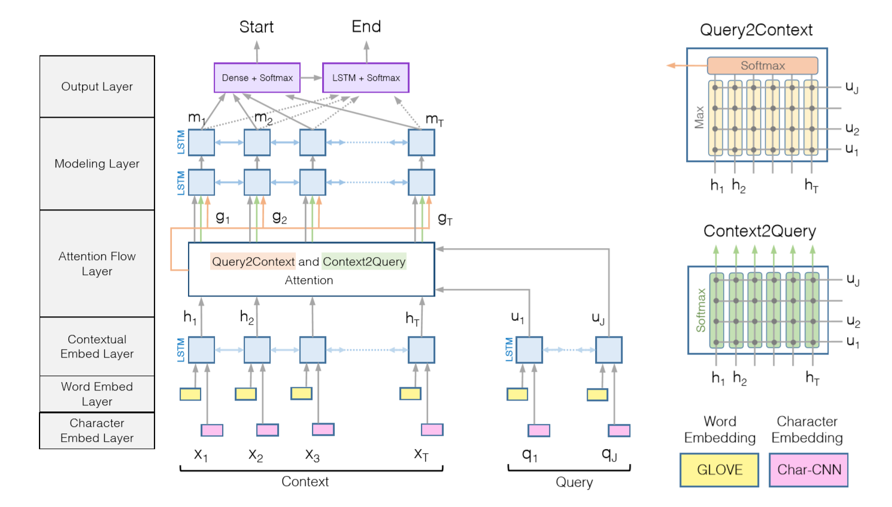

# Abstract

- 将Attention运用在MC（Machine-Comprehension）上面，已取得显著的效果。
- 论文中的模型在SQuAD和CNN/DailyMail数据上都取得`stat-of-the-art`的效果。

# Introduction

- 机器翻译和QA在自然语言处理和机器视觉领域都都受到很多关注，并延伸的有很多模型。

- `end-to-end`系统大部分达到了预期效果，其中一个关键点就是使用了`神经注意力机制`，使得在在查找答案时，能够将注意力放在最相关的一些信息点，从而更有效的提取信息。
- 注意力机制一般有如下特征：
  - 计算注意力机制的权重，其中一个用途在于将一段文本编码到一个固定长度的向量，然后使用注意力机制能够有效的提取与其最相关的信息。
  - 对于文本领域，注意力机制是动态的：根据不同的文本有不同的注意上下文权重。
  - 通常是单向的，一般涉及到上下文语段或者图像。
- 这篇论文主要介绍`BIDAF`（`Bi-Diectional Attention Flow`）网络，这是一个层级架构的多层次多粒度的文本表示建模方法
  - `BiDAF`模型包括，`character-level`,`word-level`以及`contextual Embedding`这些层级的语义表示建模层次。
  - 使用双向注意力及注意流去获取与查询相关的上下文表示
- 与之前流行的基于注意力机制对话模式的模型来说，BiDAF模型具有以下提升点：
  - 首先我们的模型**并不是**将一段文本编码成一个**固定长度**的上下文词向量
  - `Attention`权重在每一层都进行提取关键信息，这样上一层通过注意力机制筛选过的数据流向下一层继续做注意力提取，这样貌似听起来还不错，可这样会导致信息的流失，所以此模型将通过Attention提取后的信息和原信息一起流向下一层，这样能够保证信息的完整性，以供后续模型层做数据处理和信息提取。
  - 其次，使用一个低存储的注意力机制，通过迭代计算注意机制，使`Attention`机制专注于计算`Query`与`Context`之间的关系，最终能够生成根据问题找答案的一个注意力提取参数权重。
  - 实验结果证明，低存储的注意力机制相对于动态注意力机制有一个很明显的优势和性能提升。
  - 最后，使用注意力机制在双向`BiLSTM`，`Query-to-Context`，`Context-to-Query`，能够充分提取相关信息。

- 此论文模型一经发布，立刻刷榜斯坦福问答数据（`SQuAD`)。修改输出层后，`BiDAF`模型在`CNN/DailyMail`数据集上也取得了最好的结果。

# 模型

论文中的机器理解模型是一个层级多处理的复杂六层模型。

- **Character Embedding Layer**：使用`Character-Lvel CNNs`模型将每一个单词映射成一个向量
- **Word Embedding Layer**：使用预训练词向量
- **Contextual Embedding Layer**：上下文相关词向量
- **Attention Flow Layer**：通过将`Query`和上下文词向量做注意力机制，从而针对文本中每个单词生成具有`query`感知性的词向量。
- **Modeling Layer**：应用一个`LSTM`网络来提取上下文中的信息
- **Output Layer**：用于一个生成回答的模型层

上图中的输入输出最好是配合着颜色来查看

## Character Embedding Layer

这层能够将每个单词映射到一个高纬度向量，例如使用 $\{ x_1, x_2, ... , x_T \}$ 和 $\{ q_1, q_2, ... , q_J \}$ 来表示文本和查询中每个单词。

使用CNN（见参考论文，俗称Char-CNN）层来对实现对每个单词的编码，以获取**Character Level Embedding**，具体细节可以看论文。

## Word Embedding Layer

也能够将每个单词映射到一个高纬度，不过此处使用Glove的预训练词向量。

`Character Embedding` 和 `Word Embedding` 需要进行拼接，然后送入到一个两层[`Highway Network`](https://arxiv.org/abs/1505.00387)，输出是两个`d`维度的序列向量。分别为

- `H-context`：${ X \in R^{d \times T}}$
- `U-query` ：${X \in R^{d \times J}}$

## Contextual Embedding Layer

基于上面的 `Embedding Layer`，使用Bi-LSTM来生成上下文词向量，从中提取出**序列**信息，并将双向的词向量最终拼接到一起，以获取双向词向量信息，例如`Word Embedding`层的输出就为：context -${ X \in R^{2d \times T}}$，query - ${X \in R^{2d \times J}}$的向量。

值得注意的是，模型的前三层是从查询和计算特性提取出多个不同粒度的信息，以提供给模型后续从中充分提取出信息。

## Attention Flow Layer

上面三层主要是为了从文本和查询中提取出多个不同层次，不同粒度下的信息，而这个层就是为了**链接**和**融合**文本和查询信息。和之前的attention机制原理不一样，`Attention Flow Layer`不是用来对文本和查询编码到一个上下文词向量，相反，每个时间步数上的向量以及前三层的词向量，都能够一起输入到`Modeling Layer`网络，这样能够减少早期预处理信息(前三层)中的信息流失现象。

通过模型架构图就可知，输入为`H-context`和`U-query`，通过`Attention Flow Layer`处理之后的数据，输出是一个`query-aware`的文本（context）词向量表示，同时也伴随着有前三层对的`contextual embeddings`。这里的`query-aware`顾名思义能够理解成一个：具有感知查询能力的文本词向量表示。

在此层，我们从两个方面计算attention：`Context2Query`和`Query2Context`，这两个attention都源于一个相似矩阵${ S \in R^{T \times J} }$，比如$S_{tj}$就标识`t-th context`单词和`j-th query`单词的相似度，这两个相似矩阵是通过 H-context 和 U-query 两个矩阵计算得来，公式如下：

$$S_{ij} = \alpha (H:_t, U:_j) \in R $$

其中$\alpha$是一个通过训练得来函数，返回结果为一个标量，能够计算两个单词的相似度，这就好比如`Word2Vec`中计算两个词向量的相似度方法类似。

### Context2Query Attention

这层网络能够计算出查询单词与文本中的哪些单词最相似。令$\alpha_t \in R^j$表示第$t$个查询单词上的权重在第$t$个文本单词上的权重，则有$\sum a_{tj} = 1$。Attention层的权重通过$a_t = softmax(S_t:) \in R^J$计算得来。

### Query2Context Attention

这层网络与`Context2Query`类似。

## Modeling Layer

这层网络的输入就是Attention Flow Layer的输出$G$（是一个`query-aware`的文本单词表示），整个网络能够基于查询捕捉文本单词之间的联系。这一点和Contextual Embedding 层不一样，其不基于查询，来捕捉文本单词之间的联系。这里使用双向LSTM，隐藏层输出为d维度的，于是就能够获取一个${M \in R^{2d \times T} }$ 矩阵，这就是整个层网络的输出，每一列都是一个代表着文本和查询单词的上下文信息。

## Output Layer

输出层就是特定的网络结构，BiDAF网络允许你根据特定任务修改输出层，但是要保留其他层架构。于是我们针对于QA任务设置了一个特定的输出层。

QA任务层要求我们根据查询在文本中找出对应语段，对此，使用了一个`cloze-style`的理解输出层。输出层由于是文本中的一段文本，所以我们需要获取到对应的开始索引和结束索引。那么 start索引公式如下所示：

$$P^1 = softmax(W_{p^2}^T[G;M^2])$$

其中${w_{(p^1)} \in R^{10d}}$，这是一个可训练的权重向量。

为了获取end索引，我们将`M`塞入另外一个Bi-LSTM网络，并获得一个$M^2 \in R^{2d \times T}$矩阵，然后我们使用一个softmax函数来获取end索引，公式如下：

$${ p^2 = softmax(W_{p^2}^T[G;M^2]) }$$

## 训练

损失函数如下所示：

$$L(\theta) = - \frac{1}{T} \sum_i^{N}log(p_{y_i^1}^1) + log(p_{y_i^2}^2)  $$

其中的$\theta$是一模型中所有可训练的权重，例如：CNN 的卷积核权重和bias，LSTM单元格权重，$W_{(S)}$,$W_{(p^1)}$以及$w_{(p^2)}$，N是语料库中的数量，$y_i^1$和$y_i^2$是开始和结束索引。

## 测试

最终生成一个索引`(k,l)`,其中${ k \le l}$。

# 相关工作

## 机器理解

以前`end-to-end`使用attention机制的机器理解主要有三种方式。

- 第一个使用动态注意力机制：内部的权重根据查询和文本动态更新，而BiDAF模型使用一种低存储注意力机制。
- 第二个每次只计算一次注意力机制，然后就将结果喂给输出层。其中Attention-over-Attention 模型使用一个基于查询和文本的2D相似矩阵来计算query-to-context注意力权重。与这些模型相比，BiDAF模型没有在注意力层编码两个相似性，而是将注意力的权重直接流向RNN网络层。
- 第三个应该算是一中Memory Network的扩展，其在多个网络层中重复计算查询和文本，经典的就是`multi-hop`模型，其将强化学习和Memory Network融合在一起，然后动态控制循环的次数。

## 可视化问QA

在计算机视觉领域，QA任务也获得了很大的关注。早期工作主要集中在`visual question answering`(VQA)，包括使用RNN来对问题进行编码，使用CNN来图片编码，然后将两者结合起来从而能够回答其问题。注意力机制能够很成功的应用在VQA任务中，在图片中能够将关注度放在具体某一个小块中然后进行对应的数据提取。

这一块的任务也是一个非常热门且困难领域，以后可以在这些方向深入掌握。

# 总结

在这篇论文中介绍BiDAF模型，这是一个多层次处理数据，以在不同粒度下表示上下文，同时使用一个双向注意力流机制来实现一个query-aware上下文表示。实验表明这个模型在SQuAD和CNN/DailyMail数据集上能够取得很好的效果。

# 参考论文

- [Kim, Yoon. "Convolutional neural networks for sentence classification." arXiv preprint arXiv:1408.5882 (2014).](https://arxiv.org/abs/1408.5882)
- [Srivastava, Rupesh Kumar, Klaus Greff, and Jürgen Schmidhuber. "Highway networks." arXiv preprint arXiv:1505.00387 (2015).](https://arxiv.org/abs/1505.00387)